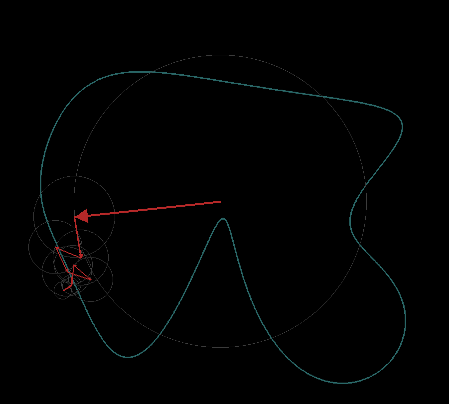
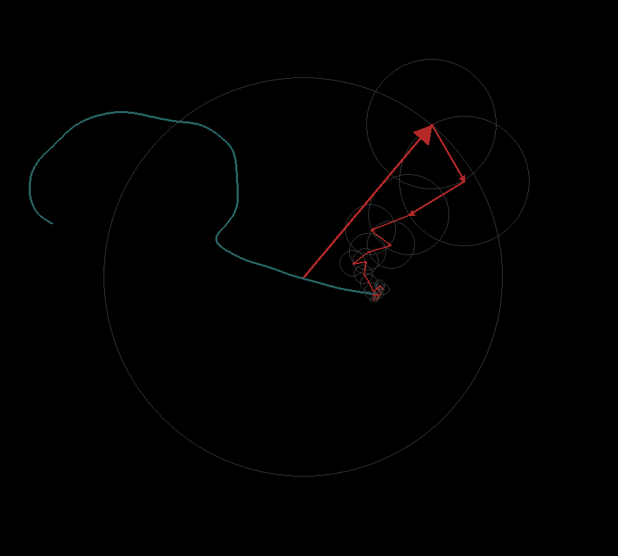

# Epicycles
Draw anything on the screen and have it recreated by the rotating arrows of a complex Fourier series.

  
   

### Requirements:
numpy and pygame need to be installed.

### How to use:
- Edit the `number_of_arrows` parameter to any positive integer.
- Run the script
- Draw on the screen by pressing down on the left mouse button.
- Press enter to start the arrow visualization. Press enter at any point to pause and c to go back to drawing.
